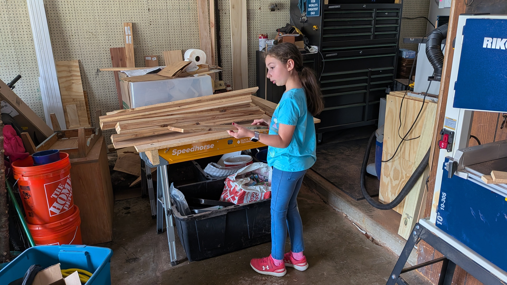
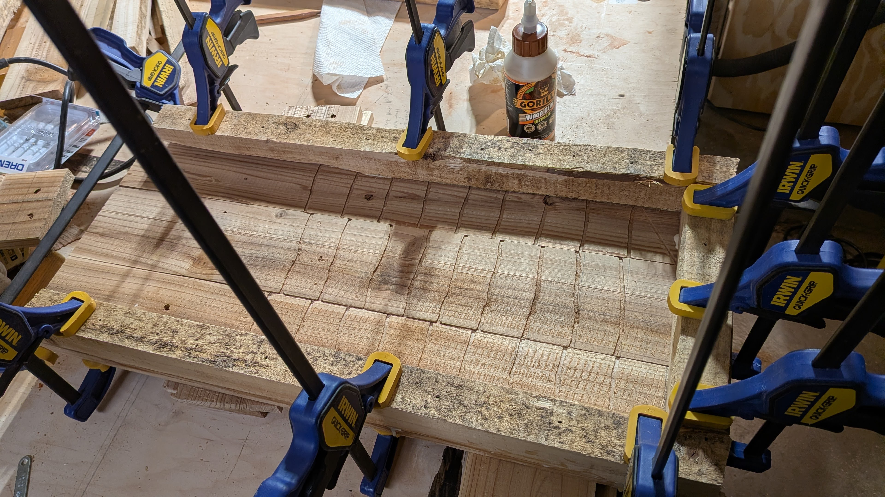
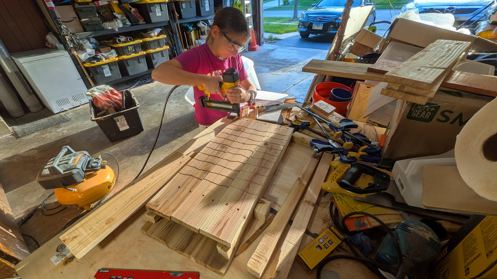

This is a document about my 4H Woodworking Project for 2026.

# Project Selection
I chose a bat box to make because, when I have a fire in my backyard my mom gets bit by mosquitoes and the bats will eat them. I was also interested in how to make a bat box.

# Material Selection
Home Depot donated a cedar pallet. My helper dismantled the pallet. I selected 12 boards for the project.

# Rough Dimensions 

Back panel 11 1/2" x 24" x 1/2"

Center panel 11 1/2" × 22" ×1/2"

Front face 11 1/2" x 20" x 1/2"

# Order of Operations 

1. Measured and cut to right length 
2. Helper used bandsaw to rip dividers to width and cut 15° angle at bottom of face.
3. Cut four chamber spacers to length and two internal supports.
4. Before glue up layed out frame and marked off interior.
5. Used dremel rotary to cut kerfs for bats to hang from.
6. Glued internal frame to back.
7. Glued internal divider frame layer to back layer.

8. Glued front face planks.
9. Glued front face to box.

10. Lightly sanded sides to prepare flat surface.
11. Glued side rails.
12. Measured and marked 15°angle for roof and cut.
13. Measured and marked 55°angle for bottom of box and cut.
14. Selected 1/8" drill bit for ventilation holes and drilled.
15. measured back and marked mounting hardware, Brad hole T nuts.
16. Width of the back of the box is 10 5/8"+ exterior sides 23" 
17. Centered and placed hardware.
18. Glued two boards together along edge of the roof
19. Helper used bandsaw to cut angle at the rear of the roof 
20. Glued rear slat to the roof 
21. Sanded all surfaces untill smooth.
22. Applied finish
Project Complete 
23. Helper built presentation stand.

